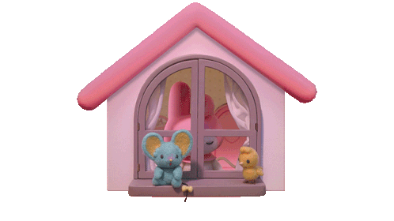

# 🎀 Hi, I'm Bella

🩺 Nursing Student  FIK S1
🏫 UNIVERSITAS MUHAMADIYAH KALIMANTAN TIMUR

*"Learning one step at a time."*

---

## 💗 About Me

- 🩺 Nursing Student
- 📚 Currently studying Anatomy, Physiology & Pharmacology
- ☕ Coffee + Music = Study Time
- 🎀 My Melody Lover

---
🩺 Nursing Portfolio

Selamat datang di portofolio keperawatan saya.

Repository ini berisi kumpulan materi, laporan praktikum, asuhan keperawatan (Askep), evidence-based nursing, serta dokumentasi pembelajaran selama menempuh pendidikan keperawatan.

## 📚 Daftar Isi
- Dasar-Dasar Keperawatan
- Anatomi & Fisiologi
- Farmakologi
- Keperawatan Medikal Bedah
- Keperawatan Anak
- Keperawatan Maternitas
- Keperawatan Jiwa
- Keperawatan Gawat Darurat
- Keperawatan Komunitas
- Keperawatan Gerontik

## 📝 Dokumentasi
- Pengkajian Pasien
- Diagnosa Keperawatan (SDKI)
- Luaran Keperawatan (SLKI)
- Intervensi Keperawatan (SIKI)
- Implementasi
- Evaluasi
- SOAP Note

## 📂 Studi Kasus
- Askep Hipertensi
- Askep Diabetes Melitus
- Askep Stroke
- Askep Pneumonia
- Askep Gagal Jantung
- Askep Demam Berdarah Dengue (DBD)

## 🎯 Tujuan
Repository ini dibuat sebagai media belajar, dokumentasi akademik, dan pengembangan kompetensi di bidang keperawatan berdasarkan praktik berbasis bukti (Evidence-Based Nursing).

---

*"Compassion, Competence, and Professionalism in Nursing Care."* 🤍
## 🎵 Spotify
https://open.spotify.com/user/31myrhcw4ekudkp2tks6ihf3f3ge?si=zGElewI1THyrn9rm0WoAdA&utm_source=copy-link

## 💜 Discord

https://discord.com/users/1354805164594172028

## 📊 GitHub Stats

